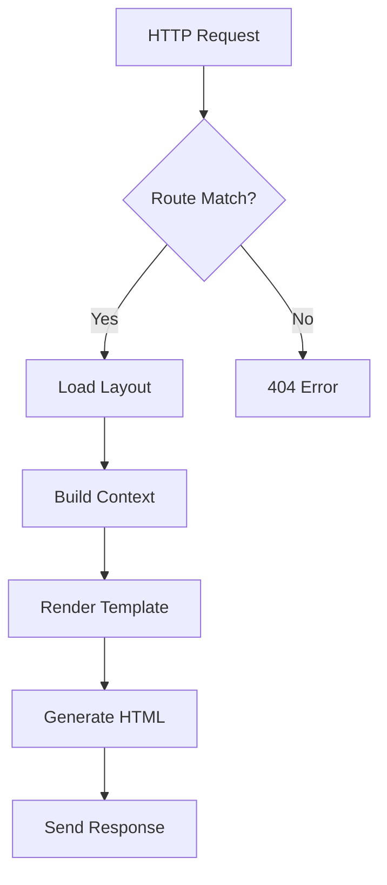
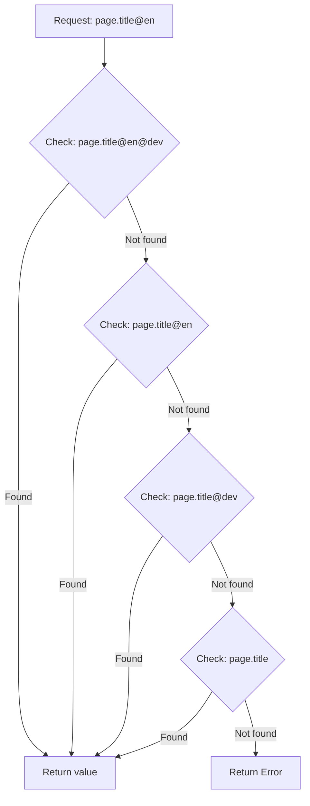

# REED-90-02: Comprehensive Manual Documentation

## MANDATORY Development Standards

**CRITICAL**: Every implementation MUST follow these standards:

- **Language**: All documentation in BBC English
- **Principle**: Didactically professional, clear, and accessible
- **Structure**: Layer-by-layer approach following 10-layer architecture
- **Code Examples**: Minimal but highly expressive examples only
- **Visual Aids**: ASCII diagrams, Mermaid charts, tables, and lists preferred
- **Target Audience**: Professional developers and system architects
- **Tone**: Professional, clear, educational

## Ticket Information
- **ID**: REED-90-02
- **Title**: Comprehensive Manual Documentation
- **Layer**: Quality Layer (REED-90)
- **Priority**: High
- **Status**: Open
- **Complexity**: High
- **Dependencies**: All implementation layers complete (REED-01 through REED-09)

## Objective

Create comprehensive, didactically professional documentation for the entire ReedCMS system in `manual/` directory. Documentation follows the 10-layer architecture and uses context from completed tickets and function registry.

## Requirements

### Documentation Structure

```
manual/
├── README.md                           # Manual overview and navigation
├── 00-introduction/
│   ├── what-is-reedcms.md             # System overview
│   ├── architecture-overview.md        # 10-layer architecture explanation
│   ├── core-philosophy.md              # KISS, CSV, performance principles
│   └── getting-started.md              # Quick start guide
│
├── 01-foundation-layer/
│   ├── README.md                       # Layer overview
│   ├── reedstream.md                   # Universal communication system
│   ├── error-handling.md               # ReedError variants and patterns
│   └── response-types.md               # ReedResponse structure
│
├── 02-data-layer/
│   ├── README.md                       # Layer overview
│   ├── csv-architecture.md             # CSV storage philosophy
│   ├── reedbase-cache.md               # Central cache system
│   ├── backup-system.md                # XZ backup and restore
│   └── data-operations.md              # Get, set, list operations
│
├── 03-security-layer/
│   ├── README.md                       # Layer overview
│   ├── password-hashing.md             # Argon2 implementation
│   ├── user-management.md              # User CRUD operations
│   ├── role-system.md                  # Roles and permissions
│   └── authentication.md               # Auth middleware
│
├── 04-cli-layer/
│   ├── README.md                       # Layer overview
│   ├── command-structure.md            # namespace:action format
│   ├── data-commands.md                # text, route, meta operations
│   ├── user-commands.md                # User management
│   ├── role-commands.md                # Role management
│   ├── layout-commands.md              # Layout scaffolding
│   └── migration-commands.md           # Data migration tools
│
├── 05-template-layer/
│   ├── README.md                       # Layer overview
│   ├── minijinja-integration.md        # Template engine setup
│   ├── atomic-design.md                # Component structure
│   ├── filters.md                      # text, route, meta filters
│   └── hot-reload.md                   # Development workflow
│
├── 06-server-layer/
│   ├── README.md                       # Layer overview
│   ├── actix-web-integration.md        # Server setup
│   ├── request-handling.md             # Request flow
│   ├── routing.md                      # URL routing system
│   ├── client-detection.md             # Device and interaction detection
│   └── response-building.md            # HTML generation
│
├── 07-api-layer/
│   ├── README.md                       # Layer overview
│   ├── restful-endpoints.md            # API structure
│   ├── authentication.md               # API key management
│   ├── security-matrix.md              # Permission system
│   └── rate-limiting.md                # Sliding window implementation
│
├── 08-asset-layer/
│   ├── README.md                       # Layer overview
│   ├── session-hash.md                 # Cache-busting strategy
│   ├── css-bundler.md                  # CSS bundling and minification
│   ├── js-bundler.md                   # JavaScript bundling
│   └── static-server.md                # Asset serving
│
├── 09-build-layer/
│   ├── README.md                       # Layer overview
│   ├── binary-compilation.md           # Cargo integration
│   ├── asset-pipeline.md               # Build-time processing
│   └── deployment.md                   # Production deployment
│
├── 10-monitor-layer/
│   ├── README.md                       # Layer overview
│   ├── logging.md                      # FreeBSD syslog format
│   ├── metrics.md                      # Performance tracking
│   ├── health-checks.md                # System health
│   └── debugging.md                    # Development tools
│
└── appendices/
    ├── function-reference.md           # Complete function index
    ├── csv-file-formats.md             # All CSV specifications
    ├── error-codes.md                  # All error variants
    ├── performance-benchmarks.md       # Performance data
    └── migration-guides.md             # Upgrade paths
```

### Documentation Approach

**Context-Driven Documentation**:
1. Read `ticket-index.csv` to identify completed tickets per layer
2. Read `project_functions.csv` to get all functions for that layer
3. Read actual source code for implementation details
4. Cross-reference with `project_optimisations.md` for decisions
5. Write documentation layer-by-layer, successively

**Content Requirements**:

Each layer documentation MUST include:

1. **Overview**
   - Purpose of the layer
   - Key concepts
   - Integration with other layers
   - ASCII architecture diagram

2. **Core Components**
   - List of modules
   - Responsibility of each module
   - Data flow diagrams

3. **Function Reference**
   - Function signatures
   - Input/output descriptions
   - Performance characteristics
   - Error conditions
   - **Minimal but expressive code examples**

4. **Visual Aids**
   - ASCII diagrams for architecture
   - Mermaid charts for workflows
   - Tables for comparisons
   - Lists for enumerations

5. **Integration Guide**
   - How to use from other layers
   - Common patterns
   - Best practices

6. **Examples**
   - Minimal code examples (5-10 lines max)
   - Focus on clarity over completeness
   - Real-world use cases

### Style Guidelines

**BBC English**:
- Colour, behaviour, optimise, analyse, centre, metre
- -ise endings (organise, realise, specialise)
- -our endings (favour, honour, labour)
- Programme (for computer program), catalogue

**Didactic Approach**:
- Start simple, build complexity gradually
- Use analogies and metaphors where helpful
- Clear section headings with hierarchy
- Progressive disclosure of information
- Assume professional developer audience but explain ReedCMS-specific concepts

**Visual Aids Priority**:

Prefer diagrams over lengthy explanations:

```
✅ GOOD - ASCII Diagram:

    ┌─────────────────┐
    │   HTTP Request  │
    └────────┬────────┘
             │
             ▼
    ┌─────────────────┐
    │  Route Resolver │
    │  (.reed/routes) │
    └────────┬────────┘
             │
             ▼
    ┌─────────────────┐
    │ Template Render │
    └─────────────────┘

❌ BAD - Lengthy text:
"When an HTTP request arrives, it first passes through the routing
system which reads the routes.csv file to determine which template
should be rendered, and then..."
```

**Code Examples**:

Minimal and expressive only:

```rust
✅ GOOD - Minimal example:
// Get text content with fallback
let title = get_text("page.title", "en")?;

❌ BAD - Over-detailed example:
use crate::reedcms::reedbase::get::get_text;
use crate::reedcms::reedstream::{ReedResult, ReedError};

pub fn example() -> ReedResult<String> {
    let language = "en";
    let key = "page.title";
    match get_text(key, language) {
        Ok(result) => {
            println!("Got text: {}", result.data);
            Ok(result.data)
        }
        Err(e) => {
            eprintln!("Error: {:?}", e);
            Err(e)
        }
    }
}
```

### Documentation Per Layer

**Layer 01 - Foundation**:
- Focus: ReedStream, ReedError, ReedResponse, ReedResult
- Diagrams: Communication flow, error propagation
- Tables: Error variant comparison, response structure fields

**Layer 02 - Data**:
- Focus: CSV architecture, ReedBase cache, backup system
- Diagrams: Cache hierarchy, backup workflow, data flow
- Tables: CSV file formats, cache performance metrics

**Layer 03 - Security**:
- Focus: Argon2 hashing, user/role management, permissions
- Diagrams: Authentication flow, permission checking
- Tables: Permission matrix, role comparison

**Layer 04 - CLI**:
- Focus: Command structure, all CLI commands
- Diagrams: Command parsing flow, router decision tree
- Tables: Command reference, flag descriptions

**Layer 05 - Template**:
- Focus: MiniJinja integration, Atomic Design, filters
- Diagrams: Template rendering pipeline, component hierarchy
- Tables: Filter reference, variant comparison

**Layer 06 - Server**:
- Focus: Actix-Web integration, request handling, routing
- Diagrams: Request lifecycle, routing resolution
- Tables: Route matching rules, response headers

**Layer 07 - API**:
- Focus: RESTful endpoints, security matrix, rate limiting
- Diagrams: API request flow, rate limit algorithm
- Tables: Endpoint reference, permission matrix

**Layer 08 - Asset**:
- Focus: Session hash, CSS/JS bundling, minification
- Diagrams: Bundle generation flow, component discovery
- Tables: Minification steps, performance metrics

**Layer 09 - Build**:
- Focus: Binary compilation, asset pipeline, deployment
- Diagrams: Build process flow, deployment workflow
- Tables: Build flags, deployment checklist

**Layer 10 - Monitor**:
- Focus: Logging, metrics, health checks, debugging
- Diagrams: Log flow, metrics collection
- Tables: Log levels, metric types

### Implementation Process

**Phase 1: Context Gathering**
```bash
# For each layer (01-10):

1. Read ticket-index.csv → Filter by layer
2. Read project_functions.csv → Filter by file path pattern
3. Read actual source files → Extract implementation details
4. Read project_optimisations.md → Extract decisions
5. Read project_summary.md → Extract architecture notes
```

**Phase 2: Content Creation**
```bash
# For each layer:

1. Create layer README.md with overview
2. Create module documentation files
3. Add ASCII diagrams for architecture
4. Add Mermaid charts for workflows
5. Add tables for reference data
6. Add minimal code examples
7. Cross-reference with other layers
```

**Phase 3: Quality Assurance**
```bash
# For entire manual:

1. Verify BBC English throughout
2. Check all internal links work
3. Validate Mermaid diagram syntax
4. Ensure consistent terminology
5. Test all code examples compile
6. Verify didactic progression
```

### Visual Aid Examples

**ASCII Architecture Diagram**:
```
ReedCMS 10-Layer Architecture

┌─────────────────────────────────────────────────────────────┐
│ 10. Monitor Layer                                           │
│     Logging │ Metrics │ Health │ Debug                      │
└──────────────────────────┬──────────────────────────────────┘
┌──────────────────────────┴──────────────────────────────────┐
│ 09. Build Layer                                             │
│     Binary Compiler │ Asset Pipeline │ Deployment          │
└──────────────────────────┬──────────────────────────────────┘
┌──────────────────────────┴──────────────────────────────────┐
│ 08. Asset Layer                                             │
│     CSS Bundler │ JS Bundler │ Static Server               │
└──────────────────────────┬──────────────────────────────────┘
┌──────────────────────────┴──────────────────────────────────┐
│ 07. API Layer                                               │
│     RESTful │ Security Matrix │ Rate Limiting               │
└──────────────────────────┬──────────────────────────────────┘
┌──────────────────────────┴──────────────────────────────────┐
│ 06. Server Layer                                            │
│     Actix-Web │ Routing │ Client Detection │ Response      │
└──────────────────────────┬──────────────────────────────────┘
┌──────────────────────────┴──────────────────────────────────┐
│ 05. Template Layer                                          │
│     MiniJinja │ Atomic Design │ Filters │ Hot-Reload       │
└──────────────────────────┬──────────────────────────────────┘
┌──────────────────────────┴──────────────────────────────────┐
│ 04. CLI Layer                                               │
│     Parser │ Router │ Commands (Data │ User │ Role │...)   │
└──────────────────────────┬──────────────────────────────────┘
┌──────────────────────────┴──────────────────────────────────┐
│ 03. Security Layer                                          │
│     Argon2 │ Users │ Roles │ Permissions │ Auth            │
└──────────────────────────┬──────────────────────────────────┘
┌──────────────────────────┴──────────────────────────────────┐
│ 02. Data Layer                                              │
│     ReedBase Cache │ CSV Storage │ Backup System           │
└──────────────────────────┬──────────────────────────────────┘
┌──────────────────────────┴──────────────────────────────────┐
│ 01. Foundation Layer                                        │
│     ReedStream │ ReedError │ ReedResponse │ ReedResult     │
└─────────────────────────────────────────────────────────────┘
```

**Mermaid Workflow Diagram**:


**Comparison Table**:
```markdown
| Variant | Screen Width | Input Method | Use Case           |
|---------|--------------|--------------|---------------------|
| Mouse   | > 1024px     | Mouse/Track  | Desktop browsers    |
| Touch   | 320-1024px   | Touch        | Mobile/Tablet       |
| Reader  | Any          | Any          | Text-only, screen readers |
```

### Acceptance Criteria

Documentation quality checks:

- [ ] All 10 layers documented with README.md
- [ ] Each layer has module-specific documentation
- [ ] All ASCII diagrams are clear and aligned
- [ ] All Mermaid diagrams render correctly
- [ ] All tables are well-formatted
- [ ] All code examples are minimal (<10 lines)
- [ ] All code examples compile and run
- [ ] BBC English verified throughout
- [ ] No duplicate content across files
- [ ] All internal cross-references work
- [ ] Function reference matches project_functions.csv
- [ ] CSV formats match actual implementation
- [ ] Error codes match ReedError variants
- [ ] Performance data matches actual benchmarks
- [ ] Didactic progression tested with fresh reader
- [ ] Professional tone maintained throughout
- [ ] No marketing language or hype
- [ ] Clear separation of concepts
- [ ] Progressive complexity (simple → advanced)
- [ ] Analogies used appropriately
- [ ] Technical accuracy verified

### Supporting Documents

**Input Sources**:
- `_workbench/Tickets/ticket-index.csv` - Ticket status per layer
- `_workbench/Tickets/project_functions.csv` - Complete function registry
- `_workbench/Tickets/project_optimisations.md` - Architectural decisions
- `_workbench/Tickets/project_summary.md` - System overview
- `src/reedcms/**/*.rs` - Actual implementation code
- All layer ticket files (REED-XX-YY-*.md) - Detailed specifications

**Output Location**:
- `manual/` - All documentation files
- `manual/README.md` - Main entry point with navigation
- `manual/XX-layer-name/` - Per-layer documentation

### Implementation Workflow

**Step-by-step process**:

1. **Create manual/ structure**
   ```bash
   mkdir -p manual/{00-introduction,01-foundation-layer,02-data-layer,...,appendices}
   ```

2. **For each layer (sequential)**:
   ```bash
   # 1. Gather context
   grep "REED-0X" ticket-index.csv > layer_context.txt
   grep "src/reedcms/module" project_functions.csv > layer_functions.txt
   
   # 2. Create layer README.md
   # - Overview
   # - Architecture diagram
   # - Module list
   
   # 3. Create module documentation
   # - One .md file per major module
   # - Function reference
   # - Minimal examples
   # - Integration guide
   
   # 4. Add visual aids
   # - ASCII diagrams
   # - Mermaid charts
   # - Tables
   # - Lists
   ```

3. **Create appendices**:
   - Complete function index from project_functions.csv
   - CSV format specifications
   - Error code reference
   - Performance benchmarks
   - Migration guides

4. **Create master README.md**:
   - Welcome and introduction
   - Architecture overview
   - Navigation to all layers
   - Quick start guide
   - Contributing guidelines

5. **Quality assurance**:
   - BBC English spell-check
   - Link validation
   - Code example compilation
   - Diagram rendering check
   - Didactic flow review

### Example Documentation File

**Sample: `manual/02-data-layer/reedbase-cache.md`**:

```markdown
# ReedBase Cache System

## Overview

ReedBase provides O(1) lookup performance for all text, route, and metadata operations through an in-memory HashMap cache with lazy loading and environment-aware fallback.

## Architecture

    ┌──────────────────────────────────────────────┐
    │          Application Layer                   │
    └────────────────┬─────────────────────────────┘
                     │ get_text("key", "en")
                     ▼
    ┌──────────────────────────────────────────────┐
    │          ReedBase Cache                      │
    │  ┌────────────────────────────────────────┐  │
    │  │  Text Cache (HashMap<String, String>)  │  │
    │  │  Route Cache                           │  │
    │  │  Meta Cache                            │  │
    │  └────────────────────────────────────────┘  │
    └────────────────┬─────────────────────────────┘
                     │ Cache miss? Load from CSV
                     ▼
    ┌──────────────────────────────────────────────┐
    │          CSV Storage Layer                   │
    │  .reed/text.csv │ .reed/routes.csv │ ...    │
    └──────────────────────────────────────────────┘

## Cache Characteristics

| Feature         | Specification              |
|-----------------|----------------------------|
| Structure       | HashMap with RwLock        |
| Lookup Time     | O(1), < 100μs              |
| Initialisation  | Lazy (on first access)     |
| Thread Safety   | RwLock (multiple readers)  |
| Fallback        | Environment-aware (@dev)   |

## Core Functions

### get_text()

Retrieves text content with language and environment fallback.

```rust
// Simple retrieval
let title = get_text("page.title", "en")?;

// Automatic fallback chain:
// 1. page.title@en@dev
// 2. page.title@en
// 3. page.title@dev
// 4. page.title
```

**Performance**: < 100μs per lookup (cached)

### set_text()

Stores text content with atomic CSV write.

```rust
set_text("page.title", "Welcome", Some("Homepage title"))?;
```

**Performance**: < 50ms (includes CSV write and cache update)

## Environment Fallback

Mermaid workflow:



## Integration

Used by:
- Template filters (`text`, `route`, `meta`)
- CLI commands (`text:get`, `text:set`)
- API endpoints (`GET /api/v1/text/get`)

## Best Practices

1. **Use environment suffixes** for environment-specific content
2. **Keep cache warm** by accessing common keys at startup
3. **Batch operations** when setting multiple values
4. **Monitor cache size** for memory management

## Related

- [CSV Architecture](csv-architecture.md)
- [Backup System](backup-system.md)
- [Template Filters](../05-template-layer/filters.md)
```

### Notes

- Documentation creation is **final step** after all implementation complete
- Use **actual running code** as documentation source
- Verify all examples **actually compile and run**
- Documentation must be **maintainable** and easy to update
- Target audience: **professional developers** learning ReedCMS
- Focus on **"why"** and **"how"**, not just **"what"**
- Use visual aids to **reduce cognitive load**
- Keep code examples **minimal** and **expressive**

---

**Status**: Open  
**Owner**: To be assigned after implementation complete  
**Estimated Effort**: 40-60 hours (5-7 days full-time)  
**Prerequisites**: REED-01 through REED-09 complete
